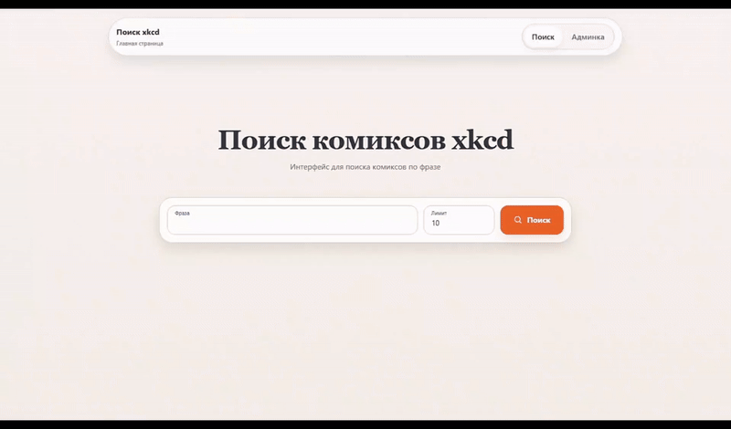

# XKCD Comics Parser

**Микросервисная система для поиска по комиксам xkcd.**  
Построена на принципах *Clean Architecture* (Ports & Adapters), что гарантирует независимость бизнес-логики от внешних инструментов.

  

## Архитектура

Система разделена микросервисы, которые общаются между собой по **gRPC**:

*   **Words Service** — нормализация входящей фразы.
*   **Search Service** — поиск по бд/индексу.
*   **Update Service** — обновляет базу в соответствии с [xkcd.com](https://xkcd.com).
*   Также существует опция сборки метрик через VictoriaMetrics.

## Гайдлайн по Make

| Категория | Команда | Описание |
| :--- | :--- | :--- |
| **Инфраструктура** | `make up` | Поднять весь стек (Docker Compose) |
| | `make down` | Остановить все контейнеры |
| | `make clean` | Полная очистка: удаление контейнеров и томов БД |
| **Тесты** | `make test` | Полный CI-цикл: очистка → деплой → тесты → очистка |
| **Инструменты** | `make proto` | Перегенерация gRPC кода из `.proto` |
| | `make lint` | Проверка кода линтерами |
| | `make tools` | Установка dev-зависимостей (`protoc-gen-go` и др.) |
